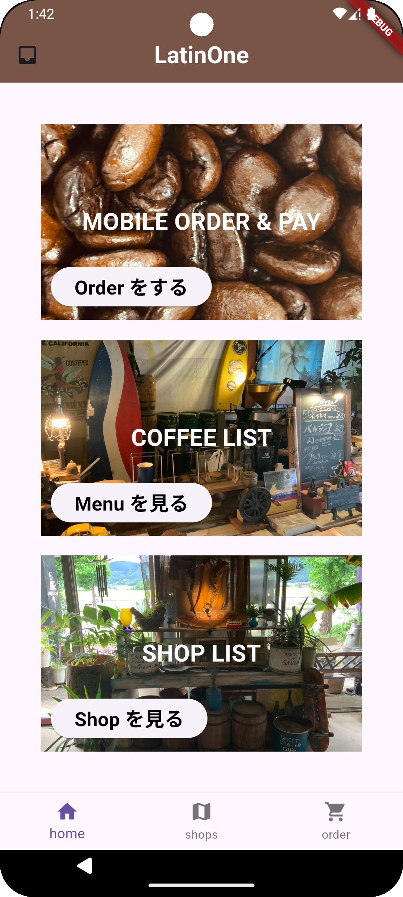
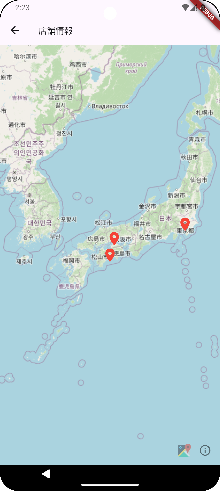
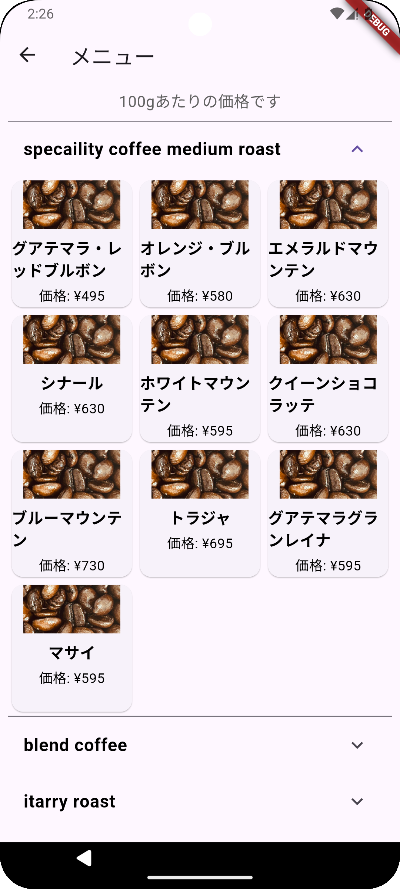
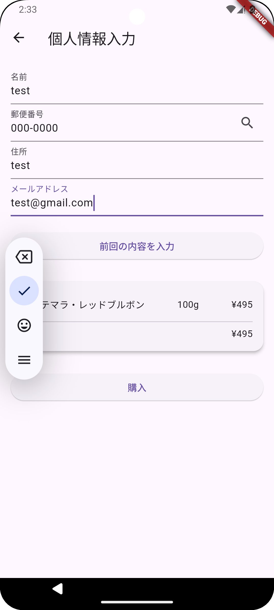

# LatinOne
## アプリの概要

2024年度乃村研勉強会で作成するコーヒーオーダーアプリ

## 開発背景

本アプリは，配送サービスがあるもののオーダー方法が直接店舗での注文や電話による注文に限られているコーヒーショップ向けに開発された．スマートフォンアプリを活用することで，手軽に商品をオーダーできる仕組みを提供することを目的としている．

## アプリ利用方法

### 店舗側

- アカウント作成：SupabaseおよびFirebaseのプロジェクトを作成し，アプリと連携する準備を行う．(参考リンク：[Firebase](https://firebase.google.com/)｜[Supabase](https://supabase.com/))
- 商品登録：supabase から商品を登録
- Firebaseの登録：

  - Firebaseプロジェクト：[https://console.firebase.google.com/project/latin-one2/overview](https://console.firebase.google.com/project/latin-one2/overview)
  - Firebase CLIのセットアップ：
    ```bash
    curl -sL https://firebase.tools | bash
    firebase login
    dart pub global activate flutterfire_cli
    export PATH= "<flutterfire_path>"
    flutterfire configure --project=<project_name>
    ```
- 通知機能のためのサーバ構築：[https://github.com/SenoOh/fcm\_server](https://github.com/SenoOh/fcm_server)

### クライアント側

- 商品選択：ホーム画面で「MOBILE ORDER & PAY」を選択し，「SelectShop」から店舗を選択する．その後，「SelectProduct」を選択し，メニューから商品を選び，カートに追加する．


<table>
  <tr>
    <th style="padding: 10px;">ホーム画面</th>
    <th style="padding: 10px;">店舗選択画面</th>
    <th style="padding: 10px;">商品選択画面</th>
  </tr>
  <tr>
    <td></td>
    <td></td>
    <td></td>
  </tr>
</table>
　

- 配送設定：配送先を設定する．

<table>
  <tr>
    <th style="padding: 10px;">配送設定画面</th>
  </tr>
  <tr>
    <td></td>
  </tr>
</table>

- 支払い：代金引換（代引き）に対応．商品受け取り時にで支払い．

## 環境

- Language：Flutter
- Version：3.19.5
- AndroidStudio（Version: 17.0.11）

### ライブラリ

- email\_validator: 3.0.0
- cupertino\_icons: 1.0.6
- flutter\_map: 7.0.2
- latlong2: 0.9.1
- flutter\_map\_animations: 0.7.0
- url\_launcher: 6.3.0
- flutter\_dotenv: 5.1.0
- supabase\_flutter: 2.6.0
- shared\_preferences: 2.0.9
- connectivity\_plus: 6.1.0
- flutter\_local\_notifications: 18.0.1
- firebase\_core: 3.4.0
- firebase\_messaging: 15.1.0
- firebase\_analytics: 11.3.0

## リファレンス

- Flutter公式ドキュメント：[https://flutter.dev/docs](https://flutter.dev/docs)
- Firebase公式ドキュメント：[https://firebase.google.com/docs](https://firebase.google.com/docs)
- Fork元：[https://github.com/nomlab/latin\_one](https://github.com/nomlab/latin_one)


